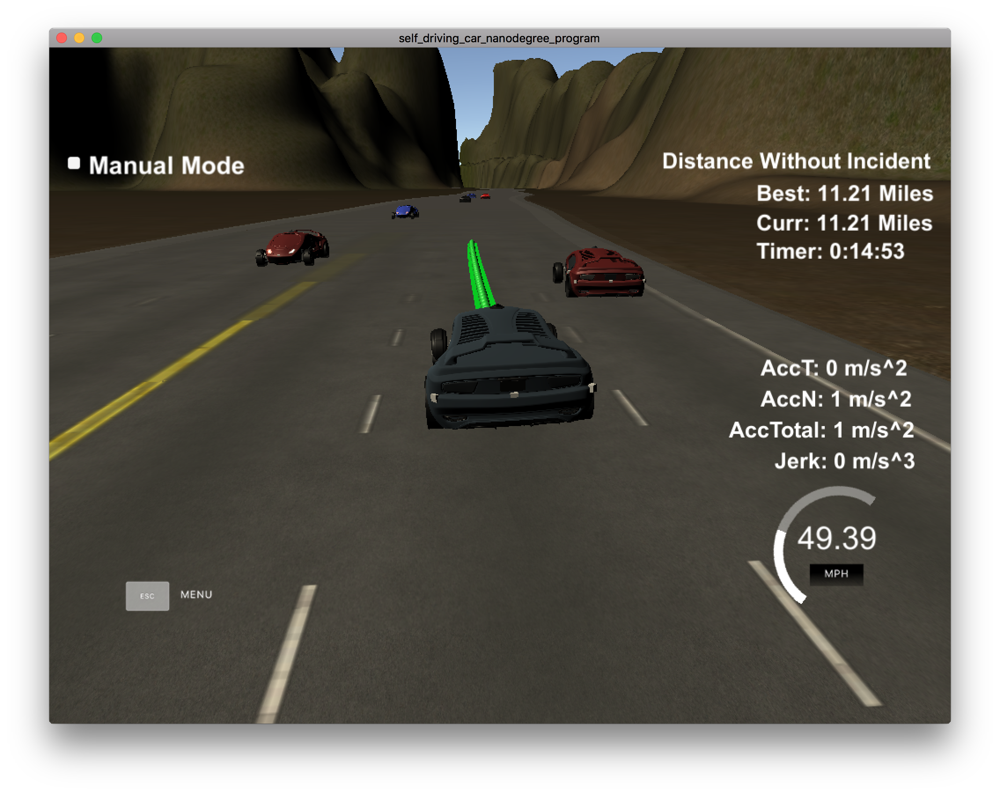

#CarND-Path-Planning-Project

Self-Driving Car Engineer Nanodegree Program

***

###Solution description

The solution attempted consists of 5 steps:

1. Determining the best lane
2. Calculating the best speed for the lane
3. Building the spline
4. Prefill the trajectory with the unused points from last iteration
5. Complete with additional points using the spline

***

##### 1. Determining the best lane

The best lane calculated in the function `best_lane()` is selected with a very simple heuristic: picking the lane where the distance to the closest car in front is the biggest while keeping a buffer distance (20mts) to the closest car behind if a line change is attempted (line 191). To do this, the information coming from sensor fusion for each car is examined (s, d, and vx/vy). Additionally, if the line change is greater than one, it changes just one if there's a gap good enough (lines 207-211), enabling a second change in a future iteration.

##### 2. Calculating the best speed for the lane

The speed is kept as close as possible to 50 (49.5) MPH when traffic is at a safe distance, checking each car position and velocity and asuming constant velocity to the end of the previously generated points. If not, it slows down at a rate of .224 MPH every 0.02s which is equivalent approximately to 5 m/s^2 (.224 MPH * 1609 (m/mi) / (0.02s * 3600s/H) ~ 5 m/s^2). All this is done in the function `calc_ref_vel()` This is based on what was explained in the Project Q&A video

##### 3. Building the spline

The spline is generated in `main()` lines 336-390. It is generated from 5 points, two in the past (either from the last two previous path points generated in the last iteration or from the current car position and orientation) and 3 from the future, at 30, 60 and 90 meters ahead in the s direction for the given lane d. Finally all the points are set in local coordinates (a traslation and rotation, lines 381-387) before instantiating the spline. This is done to prevent inestability using the spline in vertical parts for the highway (multiple y values for a given x). This is based on what was explained in the Project Q&A video

##### 4. Prefill the trajectory with the unused points from last iteration

The points generated in the previous iteration(s) available in `previous_path_x` and `previous_path_y` are added to the vectors containing the new points to send to the simulator (`next_x_vals` and `next_y_vals`) to smoothen the transition (lines 396-400).

##### 5. Complete with additional points using the spline

Additional points are generated to complete the 50 points sent every iteration to the sim. These points are built in an equal manner to what was described in the project Q&A: a horizon of 30mts is set, and the points are evenly in that distance in x, the y value is calculated using the spline and before inserting them to `next_x_vals` and `next_y_vals` the inverse traslation and rotation are applied to convert back from local (car) coordinates to global coordinates.

