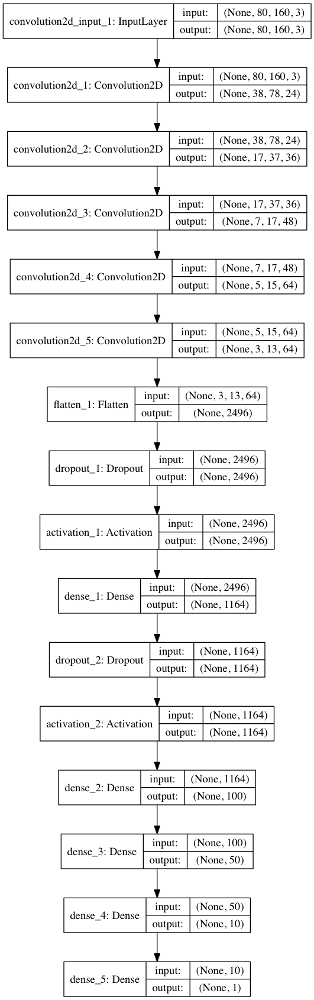
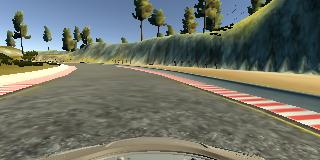
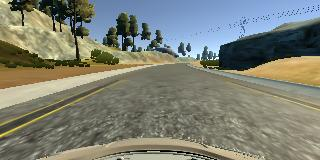
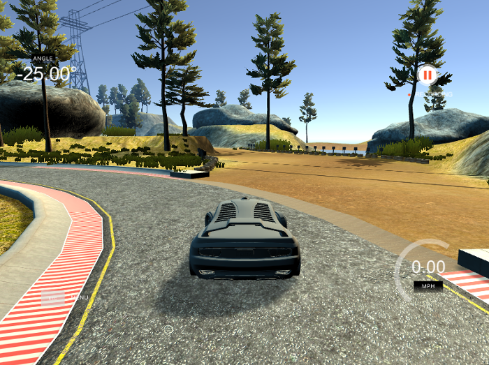

#Behavioural cloning
******************

Contents
--------
- model.py - file used to train the network. With the params 'eval', used to graph the differences between the data and the predictions
- drive.py - file provided by Udacity. Only differences were image scaling and normalisation to fit the network's input and change throttle to 0.1 when angles < 0.1, else set to 0.05 
(so that the car would slow down in closed turns)
- model.json - The model architecture.
- model.h5 - The model weights.
- README.md - this file

1. Model Architecture Design
---------------------------
The model built is based on nVidia's end to end [driving paper] (http://images.nvidia.com/content/tegra/automotive/images/2016/solutions/pdf/end-to-end-dl-using-px.pdf) Other models like a simple multilayer dense network was tried and one based on the LeNet architecture but without good results.

It consists of 5 convolutional layers, with relu activation. Then it's followed by a flatten operation, dropping out 20% of the values and a RELU activation. After that there's a Dense (multiconected) Layer with again dropout and RELU and finally 4 dense layers that end up in a single neuron that returns a float value with the targeted steering wheel angle.

2. Architecture Characteristics
------------------------------
The first layer takes the image scaled down to half of its original size (down to 160 pixels width by 80 pixels height). During the several runs, this proved not to affect negatively the model's performance while also making the running times shorter.

The first 3 convolutional layers have a kernel of 5 rows by 5 columns with 24, 36 and 48 filters. The final two have 3x3 kernels with 64 filters.

The convolutional result is then flattened and passed over by one of the 2 dropout layers from the model.
Both Dropouts take out 20% of the values. After them, ReLUs are used for activation. There's Dense layer between both sets of Dropout/ReLus layers and finally there are 4 Dense layers to get to the final neuron.

The following is block diagram for built model with their input and output shapes for each layer:

3. Data Preprocessing
---------------------
- Only images from the center camera were used for training
- Input images are scaled to half (from 320x160 to 160x80). This provided good results while making processing times shorter. Even smaller sizes shorter training times but worse results in the driving tests.
- Images are kept in RGB colorspace. Grayscale was used to try to reduce parameters but the driving became shakier and less predictable.
- Images are normalised (values for all three channels made into float values around zero showed better accuracy.
- Mirror images were generated to improve generalisation and reduce the bias to turn left. The new y value was the negative for the original image's one.
- After that, samples were shuffled and 20% of them was left for validation.

4. Model Training (Including hyper-parameter tuning)
---------------------------------------------------
Model was trained using an Adam Optimiser with a learning rate of .0001, after trying with higher and lower magnitude values, the former provided a good tradeoff between generalisation and variance, keeping the training epochs low (2-3). Mean Squared Error was used to compute the loss during the iterations. Since the process is long, specially on a CPU (see Notes), the Model is saved in each epoch using Keras callbacks.

Data used
---------
- Sample data provided by [Udacity](https://d17h27t6h515a5.cloudfront.net/topher/2016/December/584f6edd_data/data.zip). Only the center camera images were used and mirror images were generated. 
These are a few examples of the images from the data set:

**Centred steering wheel**

**Steering wheel to the Left (val ~ -0.34)**

**Steering wheel to the Right (val ~ 0.34)**

- Recovery data to prevent the car from going outside the track using the [Udacity Simulator] (https://classroom.udacity.com/nanodegrees/nd013/parts/fbf77062-5703-404e-b60c-95b78b2f3f9e/modules/6df7ae49-c61c-4bb2-a23e-6527e69209ec/lessons/46a70500-493e-4057-a78e-b3075933709d/concepts/1c9f7e68-3d2c-4313-9c8d-5a9ed42583dc). The car was put in positions were it was going to leave the track, then stopped (speed = 0) and then the wheels turned into a high degree to prevent this from happening and then the recording was done.

This procedure was repeated in several places coming to the edge of the corner with smaller degree each time. Since the velocity parameter is ignored in the training, this strategy was easier to implement and more suitable than normal driving. 

Notes
-----
- Training was done in CPU (tried creating a GPU instance in Amazon but was not enabled during the last week since they require an account to have at least one billing so that
they know the account is active and they won't be allocating resources to an inactive account (silly since they can always take it back).
- Training with keyboard or mouse was hard, inaccurate. Lots of editing for the recording had to be done.
- Training after a few epochs was enough, more than 3-4 would bring overfitting the data and instability while driving.

